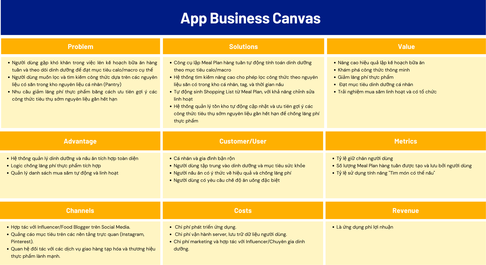

# mealpal-docs

Official documentation and wiki for the MealPal project (Mobile App Assignment).

## Business-canvas

### Cấu trúc Business Canvas (9 Khối)

#### 1. Problem (Vấn đề)

- **Mục tiêu**: Xác định và mô tả các vấn đề cốt lõi mà ứng dụng đang cố gắng giải quyết. Mục này làm rõ lý do ứng dụng của bạn cần thiết và làm nổi bật những nhu cầu mà nó giải quyết.

- **Nguyên tắc chính**:
  - Xác định thử thách cụ thể mà người dùng tiềm năng đối mặt
  - Đảm bảo vấn đề được diễn đạt từ góc độ của người dùng
  - Tránh giả định vấn đề; cần xác thực bằng nhu cầu thực tế

#### 2. Solution (Giải pháp)

- **Mục tiêu**: Mô tả cách ứng dụng sẽ giải quyết những vấn đề đã nêu, tập trung vào các tính năng cốt lõi.

- **Nguyên tắc chính**:
  - Phác thảo các tính năng chính giải quyết trực tiếp các vấn đề của người dùng
  - Giải pháp phải là danh từ (what)—một cái gì đó hữu hình đại diện cho kết quả, chứ không phải mô tả về cách thức (how) đạt được nó
  - Nhấn mạnh cách giải pháp độc đáo hoặc sáng tạo so với các giải pháp thay thế

#### 3. Value (Giá trị)

- **Mục tiêu**: Giải thích giá trị mà ứng dụng mang lại cho người dùng và tại sao họ chọn sử dụng nó. Giá trị phải làm rõ tại sao ứng dụng của bạn có lợi và cách nó cải thiện trải nghiệm người dùng.

- **Nguyên tắc chính**:
  - Tập trung vào lợi ích của người dùng
  - Giá trị phải là danh từ (what), mô tả lợi ích hoặc kết quả cụ thể mà người dùng sẽ đạt được, chứ không phải phương pháp thực hiện (how)
  - Kết nối mỗi lợi ích với một vấn đề hoặc tính năng cụ thể

#### 4. Advantage (Lợi thế cạnh tranh)

- **Mục tiêu**: Xác định lý do tại sao người dùng nên chọn ứng dụng của bạn thay vì các đối thủ cạnh tranh. Điều này có thể liên quan đến các tính năng độc đáo, quan hệ đối tác hoặc dữ liệu chuyên biệt.

- **Nguyên tắc chính**:
  - Xác định điểm bán hàng độc đáo (USPs) giúp ứng dụng khác biệt
  - Đề cập đến lợi thế công nghệ hoặc chức năng khó sao chép (ví dụ: AI, cơ sở dữ liệu phong phú)
  - Lợi thế phải là danh từ (what) phản ánh các tính năng hoặc dữ liệu độc quyền, không phải hành động hay quy trình

#### 5. Customer/User (Khách hàng/Người dùng)

- **Mục tiêu**: Xác định đối tượng mục tiêu của ứng dụng, bao gồm các chi tiết nhân khẩu học và nhu cầu riêng biệt của họ.

- **Nguyên tắc chính**:
  - Cần cụ thể về nhân khẩu học và tâm lý người dùng
  - Làm nổi bật các phân khúc người dùng khác nhau nếu ứng dụng phục vụ nhiều nhu cầu

#### 6. Metrics (Chỉ số đo lường)

- **Mục tiêu**: Xác định các chỉ số hiệu suất chính (KPI) giúp đo lường sự thành công của ứng dụng. Các chỉ số này phải được liên kết với các giá trị và lợi thế đã phác thảo.

- **Nguyên tắc chính**:
  - Chọn các chỉ số có thể định lượng phù hợp với mục tiêu của các bên liên quan (ví dụ: tăng trưởng, mức độ tương tác, doanh thu)
  - Các chỉ số phải trực tiếp ảnh hưởng đến đánh giá kinh doanh và đại diện cho sự thành công hoặc thất bại trong việc mang lại giá trị
  - Cân nhắc các chỉ số phản ánh mức độ tương tác của người dùng và tác động kinh doanh

#### 7. Channels (Kênh)

- **Mục tiêu**: Mô tả các kênh bạn sẽ sử dụng để tiếp cận người dùng và quảng bá ứng dụng.

- **Nguyên tắc chính**:
  - Liệt kê các kênh tiếp thị và phương pháp hiệu quả nhất cho đối tượng mục tiêu
  - Bao gồm các chiến lược cho cả thu hút người dùng (acquisition) và giữ chân người dùng (retention)
  - Đừng bỏ qua các kênh cộng đồng hoặc cơ quan địa phương nếu ứng dụng nhắm mục tiêu khu vực cụ thể

#### 8. Costs (Chi phí)

- **Mục tiêu**: Phác thảo các chi phí chính liên quan đến việc phát triển, ra mắt và duy trì ứng dụng.

- **Nguyên tắc chính**:
  - Bao gồm tất cả chi phí phát triển, vận hành và tiếp thị
  - Cần thực tế về các nguồn lực cần thiết. Đảm bảo ước tính chi phí dựa trên các dự báo thực tế
  - Nên gắn kết ngân sách với các mục tiêu và tính năng cụ thể

#### 9. Revenue (Doanh thu)

- **Mục tiêu**: Xác định các cách thức ứng dụng sẽ tạo ra doanh thu.

- **Nguyên tắc chính**:
  - Chọn mô hình doanh thu phù hợp với giá trị và đối tượng mục tiêu của ứng dụng
  - Cân nhắc bất kỳ quan hệ đối tác nào có thể mang lại doanh thu bổ sung
  - Đảm bảo mô hình doanh thu không làm ảnh hưởng đến trải nghiệm người dùng
